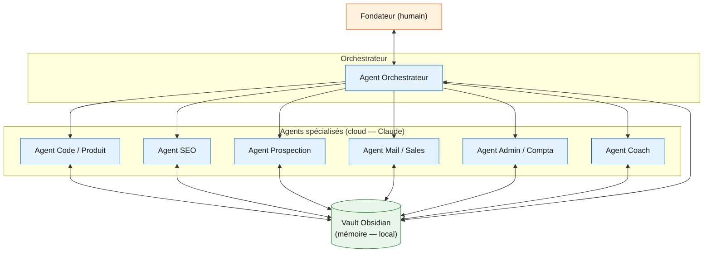

# Architecture — Web Studio OS

## Schéma

## Légende

Le **Fondateur** reste au centre des décisions et dialogue avec un
**Agent Orchestrateur** unique, qui répartit les demandes vers les six agents
spécialisés (Code/Produit, SEO, Prospection, Mail/Sales, Admin/Compta,
Coach). Tous les agents — orchestrateur compris — lisent et écrivent dans un
**vault Obsidian local**, qui sert de mémoire partagée persistante (contexte
projet, historique, notes). Les agents eux-mêmes tournent en **cloud**
(Claude), tandis que la mémoire reste **locale** sur la machine du fondateur :
c'est le choix **mixte** détaillé dans
[docs/provider-choice.md](provider-choice.md). Aucune flèche ne représente
une action automatique irréversible : les actions sensibles passent par les
règles définies dans [docs/permissions-policy.md](permissions-policy.md).
